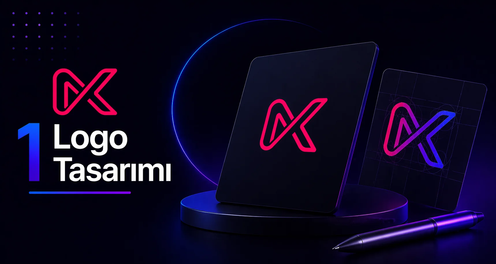

<h1 align="center"><a href="https://github.com/Nexvia-Digital-Studio/NexviaCP">Nexvia Control Panel (NexviaCP)</a></h1>

<p align="center">
  
</p>

<h2 align="center">Nexvia Dijital Stüdyo Projelerine Özel Yüksek Performanslı Web Kontrol Paneli</h2>

<p align="center">
  <strong>Geliştirici & Yayıncı:</strong> <a href="https://github.com/Nexvia-Digital-Studio">Nexvia Digital Studio</a> |
  <strong>Lisans:</strong> GPL-3.0
</p>

---

## 🚀 NexviaCP Nedir?

**NexviaCP (Nexvia Control Panel)**, Nexvia Dijital Stüdyo tarafından geliştirilen web siteleri, SaaS çözümleri, kurumsal müşteriler ve özel PHP uygulamaları için optimize edilmiş açık kaynaklı, hafif ve ultra performanslı bir Linux web kontrol panelidir. 

Tek bir VPS sunucusunda **40+ web sitesini** izole bir şekilde barındırma, akıllı kaynak kısıtlama (**cgroups RAM/CPU limitleme**), dinamik kaynak ölçeklendirme ve otomatik `.webp` görsel optimizasyonu gibi ileri seviye altyapı özelliklerine sahiptir.

---

## ⚡ Temel Özellikler & Nexvia Optimizasyonları

- **Çoklu Site Mimarisi (40+ Site Desteği):** Tek VPS üzerinde onlarca siteyi tamamen izole PHP-FPM havuzlarında performans kaybı olmadan çalıştırır.
- **cgroups (Control Groups) RAM & CPU Sınırlandırma:** Kullanıcı ve web sitesi bazında `MemoryHigh`, `CPUQuota` ve `MemorySwapMax` limitleri tanımlayarak sunucunun çökmesini engeller.
- **Dinamik Kademeli RAM Ölçeklendirme:** Organik trafik yoğunluğuna göre sitelerin RAM kullanımını kademeli olarak (örn. 256MB -> 512MB -> 1GB -> 2GB) artırır ve trafik normale dönünce kaynakları serbest bırakır.
- **Otomatik WebP Görsel Dönüştürme:** Yüklenen görselleri sunucu seviyesinde `.webp` formatına dönüştüren Nginx yapılandırma şablonları.
- **Çoklu PHP Sürümü Desteği:** PHP 7.4, 8.0, 8.1, 8.2, 8.3, 8.4 sürümlerinin aynı anda çalışabilmesi.
- **Nginx + PHP-FPM Hibrit Performans:** Statik dosyalar için yüksek hızlı Nginx web sunucusu ve izole PHP-FPM işlem süreçleri.
- **Ücretsiz SSL (Let's Encrypt):** Wildcard ve standart alan adları için otomatik yenilenen SSL sertifikaları.
- **Gelişmiş Güvenlik:** Dahili `iptables`, `fail2ban` ve `ipset` ile kaba kuvvet (brute-force) saldırı koruması.

---

## 💻 Desteklenen İşletim Sistemleri

* **Ubuntu:** 24.04 LTS, 22.04 LTS (Önerilen)
* **Debian:** 12 (Bookworm), 11 (Bullseye)

> 💡 **Not:** NexviaCP temiz, üzerinde başka bir web sunucusu (Nginx/Apache/MySQL) kurulmamış sıfır bir Linux sunucusuna kurulmalıdır.

---

## 🛠️ Kurulum Adımları

### Adım 1: Sunucuya SSH ile Bağlanın

Sunucunuza `root` yetkileri ile erişim sağlayın:

```bash
ssh root@sunucu-ip-adresiniz
```

### Adım 2: Kurulum Script'ini İndirin

```bash
wget https://raw.githubusercontent.com/Nexvia-Digital-Studio/NexviaCP/main/install/hst-install.sh
```

### Adım 3: Kurulumu Başlatın

```bash
bash hst-install.sh
```

> **Özelleştirilmiş Hızlı Kurulum (Nginx + PHP-FPM + MySQL + Multi-PHP):**
> ```bash
> bash hst-install.sh --nginx yes --phpfpm yes --apache no --multiphp yes --mysql yes --force
> ```

---

## 🔧 Kurulum Sonrası Nexvia Optimizasyonları

### 1. cgroups (RAM & CPU Sınırlandırması) Aktif Etme

Kullanıcı ve site bazlı RAM/CPU kısıtlamasını açmak için SSH terminalinde şu komutu çalıştırın:

```bash
/usr/local/hestia/bin/v-add-sys-cgroups
```

### 2. Kullanıcı/Site RAM Limiti Güncelleme

Dinamik ölçeklendirme veya manuel RAM/CPU güncellemesi için:

```bash
/usr/local/hestia/bin/v-update-user-cgroup <kullanici_adi>
```

---

## 🎨 Marka & Telif Hakkı

**NexviaCP**, [HestiaCP](https://www.hestiacp.com/) ve [VestaCP](https://vestacp.com/) projelerini temel alarak [Nexvia Digital Studio](https://github.com/Nexvia-Digital-Studio) için özelleştirilmiş ve geliştirilmiştir. **GPL v3** lisansı altında dağıtılmaktadır.

---

<p align="center">
  <sub>Developed with ❤️ by <a href="https://github.com/Nexvia-Digital-Studio">Nexvia Digital Studio</a></sub>
</p>
